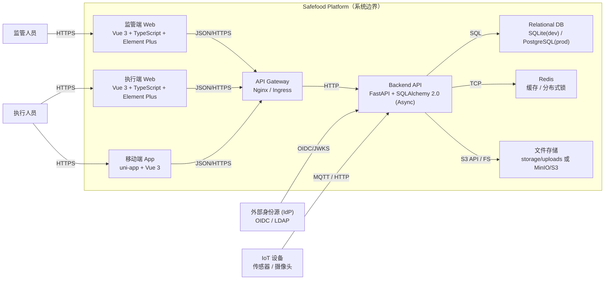

# Safefood-Platform (智慧食安平台)

[](https://opensource.org/licenses/MIT)
[](https://fastapi.tiangolo.com)
[](https://vuejs.org/)
[](https://www.python.org/)

## 1. 项目概览

**智慧食安平台** 是一套全栈式食品安全数字化管理解决方案，专为餐饮企业与监管部门设计。旨在通过数字化手段解决传统食安管理中"台账混乱、监管盲区、追溯困难"等核心痛点。

### 核心价值

- **全流程追溯**：从食材采购入库到餐桌消费，实现全链条数据留痕与溯源。
- **智能化监管**：基于 AI 视频分析与物联网设备，实现 7x24 小时自动巡检与风险预警。
- **降本增效**：通过电子台账与移动巡检，预计降低 40% 纸质文档成本与 30% 人力管理成本。

### 技术定位

采用 **Monorepo** 架构管理全栈代码。后端基于 **FastAPI + SQLAlchemy (Async)** 构建高性能微服务模块；前端采用 **Vue 3 + TypeScript** 生态，通过共享库 (`common`) 实现 Web 端与移动端 (`uni-app`) 的高效协同。

- **当前版本**: `v1.0.0`
- **维护团队**: Safefood Tech Team
- **许可证**: MIT License

---

## 2. 架构总览

### 高阶架构图 (C4 Container)



### 技术栈选型

| 领域               | 技术/工具            | 版本        | 选型理由                                                       |
| ------------------ | -------------------- | ----------- | -------------------------------------------------------------- |
| **语言**     | Python               | 3.10+       | 生态丰富，开发效率高，适合未来 AI/数据处理扩展                 |
|                    | TypeScript           | 5.0+        | 强类型约束，提升大型前端项目可维护性                           |
| **后端框架** | FastAPI              | 0.128.1     | 高性能 (基于 Starlette)，原生支持 Async/Await，自动生成 OpenAPI |
| **ORM**      | SQLAlchemy           | 2.0.46 (Async) | 强大的 ORM 功能，2.0 版本全面支持异步，类型提示友好            |
| **前端框架** | Vue 3                | 3.4+        | 组合式 API (Composition API) 逻辑复用性强，Vite 构建速度快     |
| **UI 组件**  | Element Plus         | 2.5+        | 完善的企业级后台组件库，社区活跃                               |
| **移动端**   | uni-app              | -           | 一套代码编译多端 (iOS/Android/H5/小程序)，降低开发成本         |
| **数据库**   | SQLite / PostgreSQL           | 3.x / 15+         | 开发环境用 SQLite，生产环境用 PostgreSQL     |
| **缓存**     | Redis                | 6.0+        | 高性能缓存与分布式锁                                           |

---

## 3. 目录结构映射

```bash
Safefood-Platform/
├── backend/                           # [Backend] 后端服务根目录
│   ├── alembic/                       # [DB] 数据库迁移脚本
│   ├── app/                           # [Core] 应用源码
│   │   ├── api/                       # [API] 路由定义 (RESTful)
│   │   ├── core/                      # [Config] 核心配置、安全、中间件
│   │   ├── db/                        # [Data] 数据库会话与 Base Model
│   │   └── modules/                   # [Domain] 业务模块 (DDD 风格)
│   │       ├── user/                  # 用户与组织架构
│   │       ├── ledger/                # 数字化台账核心
│   │       ├── inspection/            # 巡检流程
│   │       ├── device/                # IoT 设备接入
│   │       └── video/                 # 视频监控与 AI 分析
│   ├── tests/                         # [Test] 自动化测试用例
│   ├── tools/                         # [Tools] 开发工具脚本
│   ├── .env                           # [Env] 环境变量
│   └── requirements.txt               # [Deps] Python 依赖清单
├── frontend/                          # [Frontend] 前端 Monorepo 根目录
│   ├── common/                        # [Shared] 共享组件、工具库、类型定义
│   ├── web-admin/                     # [App] 监管端管理后台 (Vite + Vue3)
│   ├── web-execution/                 # [App] 执行端作业平台 (Vite + Vue3)
│   └── 食安 UI/                        # [Design] 设计稿目录
├── app-mobile/                        # [Mobile] 移动端应用
│   ├── app-admin/                     # [App] 监管端 App (uni-app)
│   ├── app-execution/                 # [App] 执行端 App (uni-app)
│   └── common/                        # [Shared] 移动端共享组件
├── docs/                              # [Docs] 项目文档中心
├── 启动步骤.md                        # [Guide] 启动与联调指南
└── AGENTS.md                          # [Guide] AI 代理开发指南
```

**Monorepo 策略**:

- `frontend/common`: 独立 npm 包，包含 API Client、TS 类型、通用 Utils 及基础布局/视图。
- `web-admin` / `web-execution`: 依赖 `common` 包，独立构建部署。
- `app-mobile/common`: 移动端共享组件与工具库。

---

## 4. 开发环境一键启动

### 前置依赖

- **Python**: 3.10+
- **Node.js**: 18+ (LTS)
- **HBuilderX**: 移动端开发必备（用于真机/模拟器调试）

### 快速启动脚本

详细启动步骤请参考 [`启动步骤.md`](./启动步骤.md)

快速参考：

```bash
# 1. 后端启动
cd backend
python3 -m venv .venv
source .venv/bin/activate
pip install -r requirements.txt
python -m uvicorn app.main:app --reload --host 0.0.0.0 --port 8000

# 2. Web 端启动（另开终端）
cd frontend/web-admin && npm install && npm run dev
cd frontend/web-execution && npm install && npm run dev

# 3. App 端启动（使用 HBuilderX）
# 打开 HBuilderX -> 运行 -> 运行到手机或模拟器
```

**联调账号**:

- 用户名：`admin`
- 密码：`py427123`

**默认端口**:

- 后端：8000
- Web 监管端：3000
- Web 执行端：3000（冲突时自动递增）
- App H5：5173（两端不能同时启动）

**配置管理**:

- 后端敏感配置通过 `.env` 管理。
- 生产环境密钥建议通过 Vault 或 Kubernetes Secrets 注入。

---

## 5. 核心流程与契约

### API 契约

- **OpenAPI/Swagger**: `http://localhost:8000/docs`
- **认证方式**: Bearer Token (JWT)
- **请求头**: `Authorization: Bearer <token>` + `X-App-Client: reg_app|exec_app|reg_web|exec_web`
- **响应标准**: `{ "code": 200, "msg": "Success", "data": { ... } }`

### 核心业务模块

| 模块 | 状态 | 说明 |
|------|------|------|
| 用户与组织 | ✅ 已完成 | 多租户 SaaS 架构、RBAC 权限、组织树管理 |
| 数字化台账 | ✅ 后端已就绪 | 动态表单引擎、SOP 调度 |
| 巡检业务 | ✅ 后端已就绪 | 日管控/周排查流程、状态机引擎 |
| 视频监控 | 🚧 开发中 | AI 视频分析与风险预警 |
| IoT 设备 | 📅 待开发 | 设备接入与数据采集 |

---

## 6. 编码与提交规范

### 分支模型

采用 **GitHub Flow**。

- `main`: 生产就绪代码。
- `feat/xyz`: 功能分支，通过 PR 合并回 `main`。

### 代码规范

- **Python**: 遵循 PEP 8，使用 SQLAlchemy 2.0 异步风格。
- **TypeScript**: 使用严格模式，避免 `any` 类型。
- **Commit Message**: 遵循 [Conventional Commits](https://www.conventionalcommits.org/)。
  - `feat(ledger): add bulk upload api`
  - `fix(auth): resolve token refresh issue #123`

### 多租户规范

- 所有业务模型继承 `TenantMixin`。
- 使用 `UserContext` 获取当前租户/用户信息。
- 安全守卫自动拦截跨租户访问。

---

## 7. 测试策略

| 测试层级 | 工具 | 覆盖范围 | 运行命令 |
|----------|------|----------|----------|
| **单元测试** | Pytest | 后端核心逻辑、工具函数 | `cd backend && pytest tests/` |
| **冒烟测试** | Pytest | 关键业务流程 | `cd backend && pytest tests/test_smoke.py` |

运行单个测试：
```bash
cd backend && pytest tests/test_form_engine.py::test_name
```

---

## 8. 构建与部署

### 数据库迁移

```bash
cd backend
alembic upgrade head                            # 应用迁移
alembic revision --autogenerate -m "message"   # 创建迁移
```

### 部署策略

- **Dev**: SQLite 本地开发。
- **Prod**: PostgreSQL，通过环境变量配置数据库连接。

---

## 9. 文档导航

| 文档类型 | 路径 | 说明 |
|----------|------|------|
| 架构文档 | [`docs/architecture/`](./docs/architecture/) | 系统架构设计与 API 契约 |
| 后端文档 | [`docs/backend/`](./docs/backend/) | 后端实现细节与 ER 图 |
| 前端文档 | [`docs/frontend/`](./docs/frontend/) | 前端开发指南与 API 对接 |
| 移动端文档 | [`app-mobile/README.md`](./app-mobile/README.md) | uni-app 开发指南 |
| 启动指南 | [`启动步骤.md`](./启动步骤.md) | 后端 + Web+App 启动与联调 |
| AI 代理指南 | [`AGENTS.md`](./AGENTS.md) | 开发代理规范与代码风格 |

---

## 10. 常见问题

### 数据库连接问题

- **现象**: 启动时报数据库连接错误
- **解决**: 检查 `.env` 中 `DATABASE_URL` 配置，开发环境默认使用 SQLite

### App 真机调试网络问题

- **现象**: 真机提示网络错误
- **解决**: 
  1. 确保后端使用 `--host 0.0.0.0` 启动
  2. 手机和电脑在同一 Wi-Fi
  3. 在 App 登录页设置 baseUrl 为电脑局域网 IP

### 端口冲突

- **现象**: Vite 启动失败
- **解决**: Vite 会自动递增端口 (3000→3001→3002)，查看控制台输出

---

## 11. 贡献指南

1. **Issue**: 提交 Issue 描述 Bug 或 Feature。
2. **Branch**: 从 `main` 切出 `feat/xxx`。
3. **Commit**: 遵循规范。
4. **PR**: 提交 Pull Request，需通过 CI (Lint + Test)。
5. **Review**: 等待 Maintainer 评审。

---

## 12. Roadmap

- **v1.0 (Current)**: 核心业务模块
  - ✅ **用户与组织**: 多租户 SaaS 架构、RBAC 权限、组织树管理
  - ✅ **数字化台账**: 动态表单引擎、SOP 调度
  - ✅ **巡检业务**: 日管控/周排查流程
  - 🚧 **视频监控**: AI 视频分析
  - 📅 **IoT 设备**: 设备接入
- **v1.1**: AI 视频分析与风险预警
- **v1.2**: 高级报表与数据大屏
