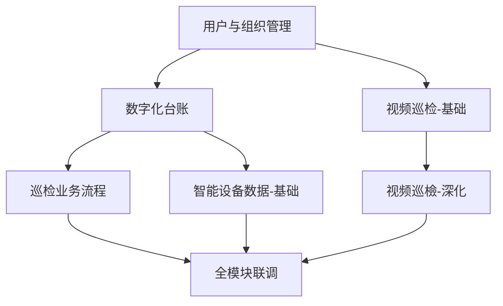
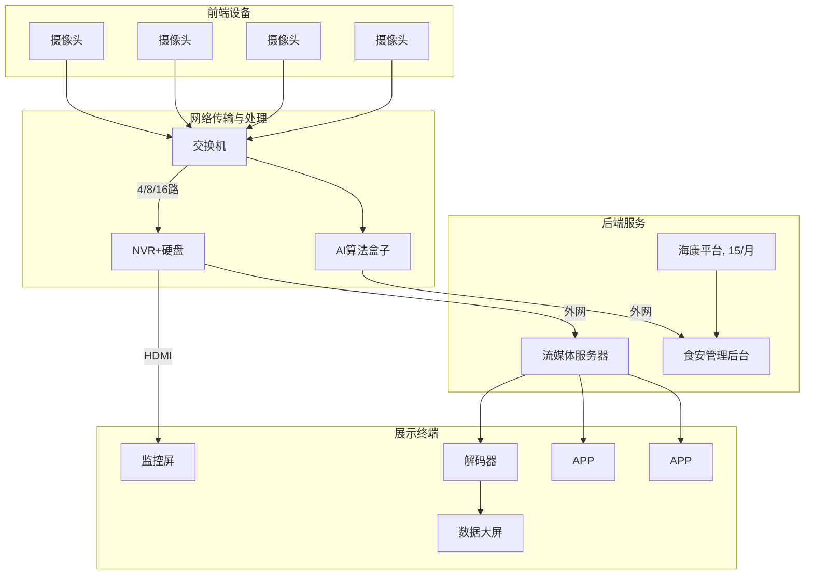
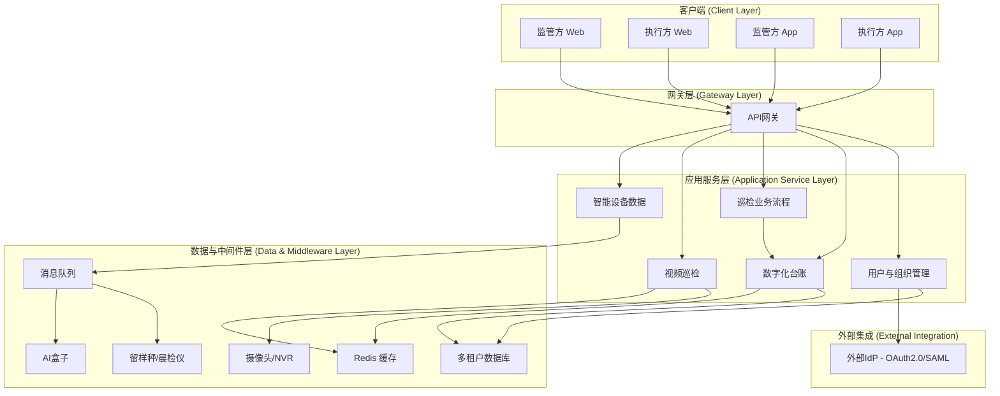

好的，这是根据您提供的三份文档内容转换成的 Markdown 格式。

---

### 文档一：智慧食安V1.0.0模块开发节奏与并行规划 (精简版)

- 智慧食安V1.0.0模块开发节奏与并行规划(精简版)
- 模块开发节奏总览(含并行关系)
- 模块依赖与并行关系图
- **!** 并行开发关键保障措施
- 每周关键动作清单(小组长视角)

## 智慧食安V1.0.0模块开发节奏与并行规划 (精简版)

> **核心原则**: 依赖显式化 + 接口契约先行 + 并行最大化

---

### 📅 **模块开发节奏总览 (含并行关系)**

| 开发阶段 | 模块 | 核心功能 | 依赖模块 | 风险提示 | 细化会议 |
| :--- | :--- | :--- | :--- | :--- | :--- |
| **第1周** (奠基) | 用户与组织管理 | 多租户框架、RBAC权限、外部IdP适配器 | 无 | 外部IdP对接依赖集成商响应 | 第1周初 |
| **第2周** (双线并行) | 数字化台账 | 动态表单引擎、SOP任务调度、台账模板管理 | 用户模块 | 表单复杂度高, 需前端深度配合 | 第2周初 |
| | 视频巡检 (基础部分) | 流媒体代理层(RTSP→HLS)、视频矩阵基础 | 用户模块 | 协议转换性能风险 (延迟>1秒) | 第2周初 |
| **第3周** (三线并行) | 巡检业务流程 | 四类巡检工作流、审核流动态路由 | 台账模块 | 联合巡检逻辑复杂, 需深度联调 | 第3周初 |
| | 智能设备数据 (基础部分) | 留样秤/晨检仪接入、Mock服务 | 台账模块 | 硬件依赖强 (SDK未获取) | 第3周初 |
| | 视频巡检 (深化部分) | App端视频调用、与巡检流程整合 | 巡检模块 (整合部分) | 代理服务需独立部署 | 第3周中 |
| **第4周+** (集成攻坚) | 全模块联调 | 硬件实测、性能压测、UAT支持 | 全模块 | 留样秤数据回填、视频延迟达标 | 按需召开 |

💡 **并行逻辑说明:**

*   **第2周双线**: 台账与视频巡检均只依赖用户模块, 无交叉依赖 → 可完全并行
*   **第3周三线**:
    *   巡检流程 + 智能设备数据: 均依赖台账模块基础API (第2周已冻结) → 可并行开发
    *   视频巡检深化: 基础部分已完成, 整合部分等待巡检模块接口 → 分阶段推进
*   **关键保障**: 第2周必须冻结《台账API契约》, 供巡检/设备模块调用

---

### 🔗 **模块依赖与并行关系图**

*流程说明：*
*   `用户与组织管理` 是基础，被 `数字化台账` 和 `视频巡检-基础` 依赖。
*   `数字化台账` 完成后，`巡检业务流程` 和 `智能设备数据-基础` 才能开始。
*   `视频巡检-基础` 完成后，`视频巡检-深化` 才能开始。
*   最后所有模块汇集到 `全模块联调`。

✅ **并行价值:**

*   总开发周期压缩 **30%+** (串行需10周 → 并行8周)
*   硬件风险前置: 设备模块第3周启动, 避免最后堆积问题
*   资源高效利用: 5人团队全程满负荷, 无等待空窗期

---

### ⚠️ **并行开发关键保障措施**

| 风险点 | 保障措施 | 责任人 |
| :--- | :--- | :--- |
| **接口契约未冻结** | 第2周输出《台账API契约V1》, 三方签字确认 (后端+前端+测试) | 产品经理 |
| **视频整合延迟** | 视频巡检分两阶段: 基础部分独立交付, 整合部分用Mock数据保底 | 后端组长 |
| **硬件对接卡点** | 产品经理第1周锁定SDK, 设备模块同步开发Mock服务 | 产品经理 |
| **联调冲突** | 每日站会明确: "今日是否阻塞他人? 被何模块阻塞?" | 小组长 |

---

### 📌 **每周关键动作清单 (小组长视角)**

| 周次 | 核心动作 | 交付物 | 并行协同要点 |
| :--- | :--- | :--- | :--- |
| **第1周** | 用户模块细化 + 多租户框架搭建 | 租户隔离验证报告 | 无 (单线启动) |
| **第2周** | 台账API契约冻结 + 视频代理MVP | 《台账API契约V1》签字版 | 台账组每日同步API进展, 视频组用Mock数据开发 |
| **第3周** | 巡检/设备/视频三线开发 | 留样秤Mock回填Demo + 视频墙可用 | 巡检组与设备组共用台账API, 视频组等待巡检接口时开发Mock |
| **第4周+** | 硬件实测 + 全链路压测 | 留样秤真实联调成功 + 压测报告 | 每日同步阻塞点, 超4小时未解决立即升级 |

---
---

### 文档二：食安平台需求文档(PRD)

## 食安平台
## 需求文档(PRD)

| 版本 | 内容 | 编写人员 | 时间 |
| :--- | :--- | :--- | :--- |
| V1.0.0 | 初始版本起草 | 承恩 | 2025/12/14 |

---

### 一、产品概述

#### 1.1 产品名称

**智慧食安管理平台 1.0**

完成食安监管日管控、周排查、月调度功能, 智能设备及摄像头分权查看功能, 食堂台账提交上报功能, 满足监管使用查看需要, 满足食堂食安管理使用需要

#### 1.2 产品目标

(1) 实现面向政府机关、中小学、餐饮公司等多食堂管理需求下的食安管理能力
(2) 实现接入晨检仪、留样秤、留样冰箱、AI 盒子等产品的数据接入

---

### 二、用户群体分析

#### 2.1 目标用户

(1) **食安监管方**: 希望监管下辖食堂的食安关键问题点, 并进行主动监管处理
(2) **食堂使用方**: 通过食安系统和硬件设备减轻食安管理的工作量

---

### 三、功能需求

#### **监管端后台**

| 主要功能 | 功能描述 |
| :--- | :--- |
| **系统设置** | **1、用户中心 -** (1) 支持监管端用户账号创建、关闭、删除 (2) 支持食堂端用户账号创建、关闭、删除 (3) 支持对用户账号进行食堂、系统功能分配 (4) 支持维护食安指挥系统角色、角色权限 (5) 支持维护学校后勤部门信息, 并可进行新增、删除、修改, 同时可对部门进行关联食堂、关联检查表等操作 **2、食堂架构管理** (1) 食堂创建与信息补充维护 (2) 片区到食堂的架构自定义划分 (3) 食堂智能设备的添加关联 (4) 食堂监控摄像头的添加关联, 按食堂空间区域划分摄像头分组 (5) 查看设备的抓拍或信息记录 |
| **日周月巡检** | **1、日管控** (1) 日管控报告模板创建与下发 (2) 日管控上报记录查看 (3) 日管控完成进度查看 **2、周排查** (1) 周排查巡检表格创建与下发 (2) 周排查上报记录查看与导出 (3) 周排查整改记录审核 (4) 周排查完成进度查看 **3、月调度** (1) 月调度数据报告汇总与下载 (2) 月调度报告文件上传存档 |
| **联合巡检** | 1、同周排查, 独立进行巡检工作流程 |
| **视频巡检** | **2、视频查看** (1) 支持逐级选择食堂后, 按食堂空间区域查看视频画面 **3、视频巡检** (1) 同周排查逻辑, 进行视频抓拍巡检 (2) 直接检查表的问题项关联摄像头, 切换问题分类, 视频分组自动更换 |
| **数字化台账** | 4、台账模板创建与下发 (1) 包括需填写常用台账约 20 余类, 通过近似 Excel 的方式进行创建 (2) 支持忘填自动填写, 需签字实名 (3) 支持智能设备数据自动关联填写 5、台账填写上报记录查看与导出 6、sop 任务设定 (1) 按区域按食堂进行任务设定, 要求一类一批食堂完成要求的多张台账填写 (2) 按表格数量核对进度完成情况并展示 7、第三方台账数据上传存档 |
| **智能设备数据** | 1、留样秤记录查看 2、晨检记录查看 3、ai 行为分析查看 4、留样冰箱记录查看 |

#### **食堂端后台**

| 主要功能 | 功能描述 |
| :--- | :--- |
| **系统设置** | **1、食堂信息管理** (1) 支持修改食堂名称、营业执照等图文信息 **2、员工管理** (1) 支持更新员工晨检信息 (2) 支持增删改留样员账号信息 (3) 支持增加新员工信息 |
| **日周月巡检** | **1、日管控** (1) 日管控要求上报 (2) 日管控记录查看 **2、周排查** (1) 周排查结果整改上报 (2) 周排查记录查看 **3、月调度** (1) 月调度报告查看 |
| **数字化台账** | 1、台账填写签字上传 2、台账填写上报记录查看与导出 3、台账 SOP 完成进度查看 4、第三方台账数据上传存档 |
| **智能设备数据** | 1、留样秤记录查看 2、晨检记录查看 3、ai 行为分析查看 4、留样冰箱记录查看 |

#### **监管端食安 app**

| 主要功能 | 功能描述 |
| :--- | :--- |
| **首页** | 1、管理范围内食堂食安知识排名 |
| **日周月巡检** | **1、日管控** (1) 日管控记录查看 (2) 日管控提交与审核 **2、周排查** (1) 周排查检查打分提交 (2) 周排查记录查看 (3) 周排查整改审核 **3、月调度** (1) 月调度报告查看 **4、联合巡检** (1) 同周排查 **5、视频巡检** (1) 视频查看 (2) 视频巡检 |
| **SOP 中心** | 1、各食堂 sop 进度查看 (1) 查看各食堂 sop 任务进度 (2) 详细查看单个食堂具体进度和数据 |

#### **食堂端食安 app**

| 主要功能 | 功能描述 |
| :--- | :--- |
| **首页** | 1、食堂食安风险指数 (1) 人员风险, 关联与人相关的问题, 以下同理 (2) 食材风险 (3) 环境风险 (4) 日管控 (5) 周排查整改 (6) 月调度查看 |
| **SOP 任务中心 日周月巡检** | **1、日管控** (1) 日管控上报 **2、周排查** (1) 周排查记录查看 (2) 周排查整改提交 **3、月调度** (1) 月调度报告查看 4、各类电子台账填写上报 |
| **我的食堂** | 1、新增员工信息 2、食堂视频查看 3、智能设备信息查看等 |

---

### 四、界面与交互设计

#### 4.1 界面设计

(查看原型设计图)

---

### 五、性能需求

#### 5.1 响应时间

(1) 数据查询与提交时延小于 1 秒

---

### 六、接口对接说明

#### 6.1 集成商用户

希望对接食安平台接口, 进行初始客户开通的管理, 也就是食安平台会给到多个独立的客户使用, 比如深圳技术大学和北京信息大学, 这两个用户的所有数据都是独立的, 但是这两个客户的初始账号开通是集成商自己的平台进行授权后给到我们

---

### **摄像头结构图**

---
---

### 文档三：智慧食安V1.0.0系统整体架构图

- 智慧食安V1.0.0系统整体架构图
- 🌐 系统整体架构 (分层视图)
- 📦 模块职责说明 (核心5大业务模块)
- 🔄 模块交互关键点
- 💻 前端端能力说明
- 🔗 外部系统集成说明
- 🧑‍💻 组员须知 (3句话看懂架构)

---

## 智慧食安V1.0.0系统整体架构图

### 🌐 **系统整体架构 (分层视图)**

### 📦 **模块职责说明 (核心5大业务模块)**

| 模块 | 核心职责 | 关键能力 | 依赖关系 |
| :--- | :--- | :--- | :--- |
| **用户与组织管理** | • 多租户隔离 (tenant_id全局透传) • RBAC权限控制 (监管/食堂角色) • 食堂架构管理 (片区→食堂) • 外部IdP适配器 (对接集成商) | • 租户数据完全隔离 • 权限动态校验 | 无 (基础模块) |
| **数字化台账** | • 动态表单引擎 (JSON Schema协议) • SOP任务调度 (Cron驱动) • 台账模板管理 (20+类台账) • 任务状态机 (待办→填报→签字→归档) | • 表单动态渲染 • 任务自动派发 | 依赖用户模块 (租户/权限) |
| **巡检业务流程** | • 四类巡检工作流 (日/周/月/联合) • 审核流动态路由 (按inspection_type) • 巡检报告生成 | • 流程灵活配置 • 多部门协同支持 | 依赖台账模块 (表单/任务数据) |
| **视频巡检** | • 流媒体代理层 (RTSP→HLS/WebRTC) • 视频矩阵 (Web端多路播放) • App端视频调用 (问题分类关联) | • 视频流低延迟 (≤1秒) • 代理服务独立部署 | 依赖用户模块 (权限) |
| **智能设备数据** | • 留样秤/晨检仪数据接入 • AI盒子回调处理 • 设备数据清洗与阈值告警 | • 硬件数据自动回填台账 • 异常数据预警 | 依赖台账模块 (回填接口) |

### 🔄 **模块交互关键点**

| 交互场景 | 涉及模块 | 数据流说明 |
| :--- | :--- | :--- |
| **租户创建→任务派发** | 用户模块 → 台账模块 | 租户创建事件 → SOP调度引擎自动生成晨检任务 |
| **设备数据→台账回填** | 设备模块 → 台账模块 | 留样秤称重数据 → 自动填入App台账对应字段 |
| **视频巡检→流程关联** | 视频模块 → 巡检模块 | 视频流地址 → 关联巡检任务, 支持问题标注 |
| **权限校验全流程** | 用户模块 → 所有模块 | 每个API请求自动校验租户+角色权限 |

### 💻 **前端端能力说明**

| 端 | 核心能力 | 技术特点 |
| :--- | :--- | :--- |
| **监管方 Web** | • 租户管理 • 台账配置 • 视频矩阵监控 • 巡检审核 | 响应式设计, 支持多浏览器 |
| **执行方 Web** | • 台账填报 (Web端) • 任务查看 | 与监管Web共享组件库 |
| **监管方 App** | • 视频巡检 (调用摄像头) • 任务审核 (离线支持) • 问题上报 | 离线缓存, 弱网优化 |
| **执行方 App** | • 台账填报 (移动端) • 留样秤数据查看 • 任务接收 | 离线填报, 数据自动同步 |

**🔑 关键设计:**

*   **角色差异由后端权限控制** (前端仅渲染, 不判断逻辑)
*   **端差异由前端技术栈实现** (Web/App共享业务逻辑, 仅UI/交互适配)
*   **所有端共用同一套后端API**

### 🔗 **外部系统集成说明**

| 外部系统 | 集成模块 | 集成方式 | 关键要求 |
| :--- | :--- | :--- | :--- |
| **外部IdP** | 用户模块 | OAuth2.0/SAML | 需集成商提供测试环境 |
| **摄像头/NVR** | 视频模块 | RTSP/ONVIF | 视频流延迟≤1秒 |
| **留样秤/晨检仪** | 设备模块 | 串口/HTTP | 称重数据自动回填台账 |
| **AI盒子** | 设备模块 | HTTP回调 | 违规抓拍图片自动关联台账 |

---

### 🧑‍💻 **组员须知 (3句话看懂架构)**

1.  **后端5大模块**: 用户 (基础) → 台账 (核心) → 巡检 (流程) + 视频 (硬件) + 设备 (硬件)
2.  **前端4个端**: 监管Web/App + 执行Web/App, 角色差异由后端权限控制, 端差异由前端适配
3.  **所有端共用API**: 一套后端服务支撑4个端, 避免重复开发

> **➕ 记住**: 你负责的模块, 只需专注自身职责 + 明确上下游接口. 其他模块如何调用你、你如何调用他人, 看上方“模块交互关键点”即可

---
此文档为系统全景图, 后续细化会议将基于此架构展开 🚀