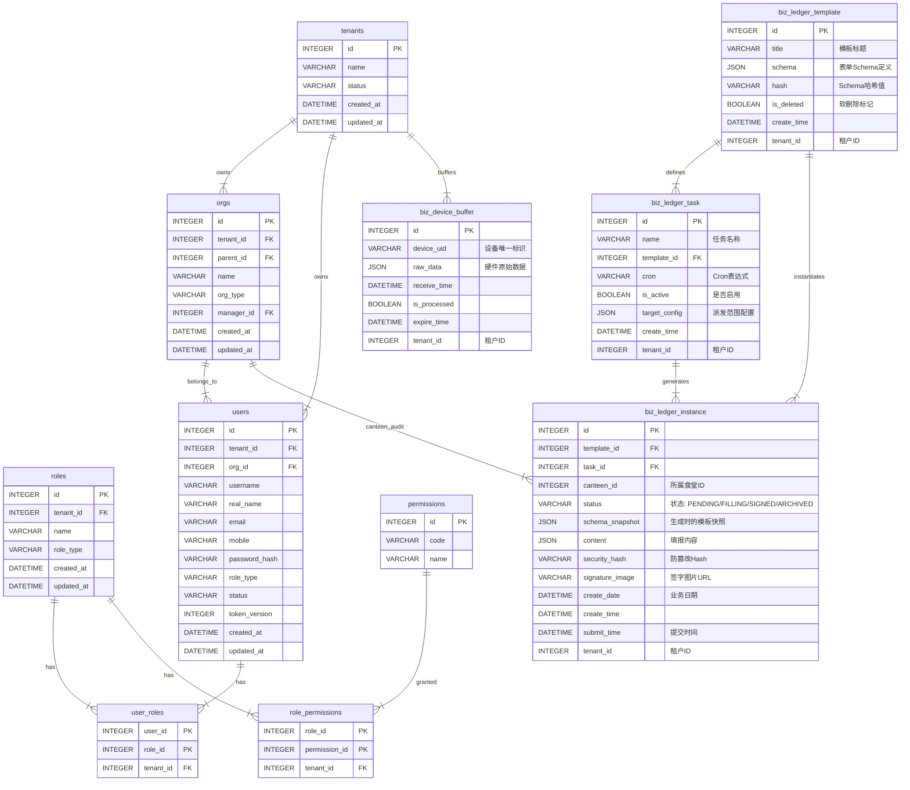

```mermaid
erDiagram
    %% 智慧食安平台 ER图 (Module 1 + Module 2 完整版)
    tenants {
        INTEGER id PK ""
        VARCHAR name  ""
        VARCHAR status  ""
        DATETIME created_at  ""
        DATETIME updated_at  ""
    }
    orgs {
        INTEGER id PK ""
        INTEGER tenant_id FK ""
        INTEGER parent_id FK ""
        VARCHAR name  ""
        VARCHAR org_type  ""
        INTEGER manager_id FK ""
        DATETIME created_at  ""
        DATETIME updated_at  ""
    }
    roles {
        INTEGER id PK ""
        INTEGER tenant_id FK ""
        VARCHAR name  ""
        VARCHAR role_type  ""
        DATETIME created_at  ""
        DATETIME updated_at  ""
    }
    users {
        INTEGER id PK ""
        INTEGER tenant_id FK ""
        INTEGER org_id FK ""
        VARCHAR username  ""
        VARCHAR real_name  ""
        VARCHAR email  ""
        VARCHAR mobile  ""
        VARCHAR password_hash  ""
        VARCHAR role_type  ""
        VARCHAR status  ""
        INTEGER token_version  ""
        DATETIME created_at  ""
        DATETIME updated_at  ""
    }
    user_roles {
        INTEGER user_id PK ""
        INTEGER role_id PK ""
        INTEGER tenant_id FK ""
    }
    permissions {
        INTEGER id PK ""
        VARCHAR code  ""
        VARCHAR name  ""
    }
    role_permissions {
        INTEGER role_id PK ""
        INTEGER permission_id PK ""
        INTEGER tenant_id FK ""
    }
    biz_ledger_template {
        INTEGER id PK ""
        VARCHAR title  "模板标题"
        JSON schema  "表单Schema定义"
        VARCHAR hash  "Schema哈希值"
        BOOLEAN is_deleted  "软删除标记"
        DATETIME create_time  ""
        INTEGER tenant_id  "租户ID"
    }
    biz_ledger_task {
        INTEGER id PK ""
        VARCHAR name  "任务名称"
        INTEGER template_id FK ""
        VARCHAR cron  "Cron表达式"
        BOOLEAN is_active  "是否启用"
        JSON target_config  "派发范围配置"
        DATETIME create_time  ""
        INTEGER tenant_id  "租户ID"
    }
    biz_ledger_instance {
        INTEGER id PK ""
        INTEGER template_id FK ""
        INTEGER task_id FK ""
        INTEGER canteen_id  "所属食堂ID"
        VARCHAR status  "状态: PENDING/FILLING/SIGNED/ARCHIVED"
        JSON schema_snapshot  "生成时的模板快照"
        JSON content  "填报内容"
        VARCHAR security_hash  "防篡改Hash"
        VARCHAR signature_image  "签字图片URL"
        DATETIME create_date  "业务日期"
        DATETIME create_time  ""
        DATETIME submit_time  "提交时间"
        INTEGER tenant_id  "租户ID"
    }
    biz_device_buffer {
        INTEGER id PK ""
        VARCHAR device_uid  "设备唯一标识"
        JSON raw_data  "硬件原始数据"
        DATETIME receive_time  ""
        BOOLEAN is_processed  ""
        DATETIME expire_time  ""
        INTEGER tenant_id  "租户ID"
    }

    %% --- 关系定义 (动态表名) ---
    tenants ||--|{ orgs : "owns"
    tenants ||--|{ users : "owns"
    orgs ||--|{ users : "belongs_to"
    users ||--|{ user_roles : "has"
    roles ||--|{ user_roles : "has"
    roles ||--|{ role_permissions : "has"
    permissions ||--|{ role_permissions : "granted"
    %% 模块二关系
    biz_ledger_template ||--|{ biz_ledger_task : "defines"
    biz_ledger_template ||--|{ biz_ledger_instance : "instantiates"
    biz_ledger_task ||--|{ biz_ledger_instance : "generates"
    orgs ||--|{ biz_ledger_instance : "canteen_audit"
    tenants ||--|{ biz_device_buffer : "buffers"
```